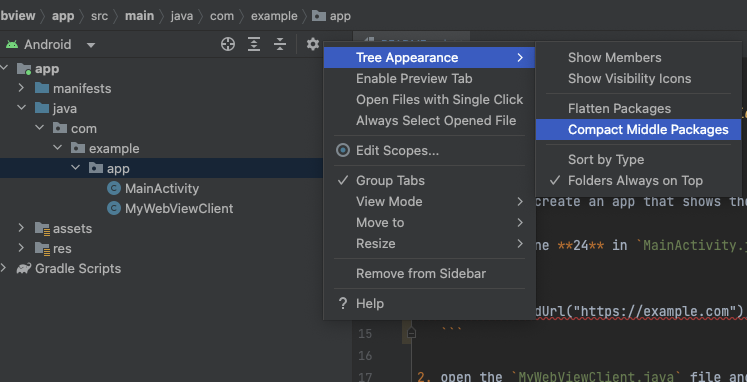
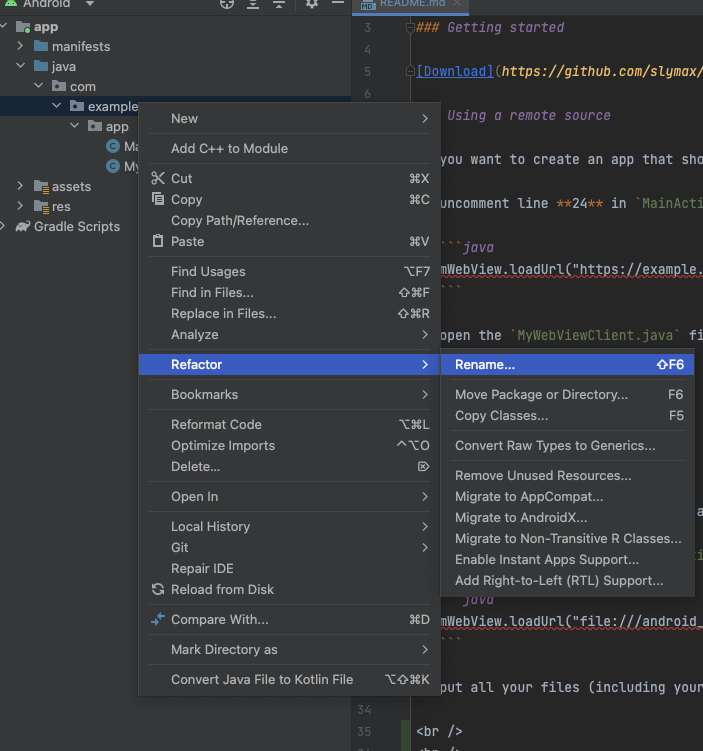
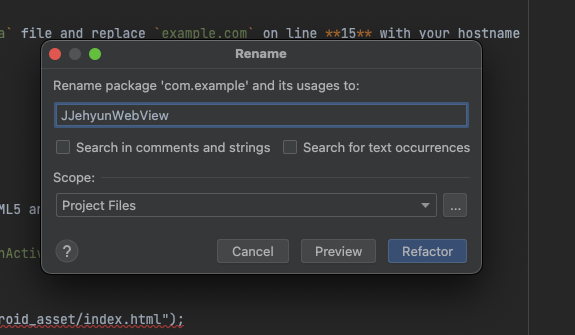
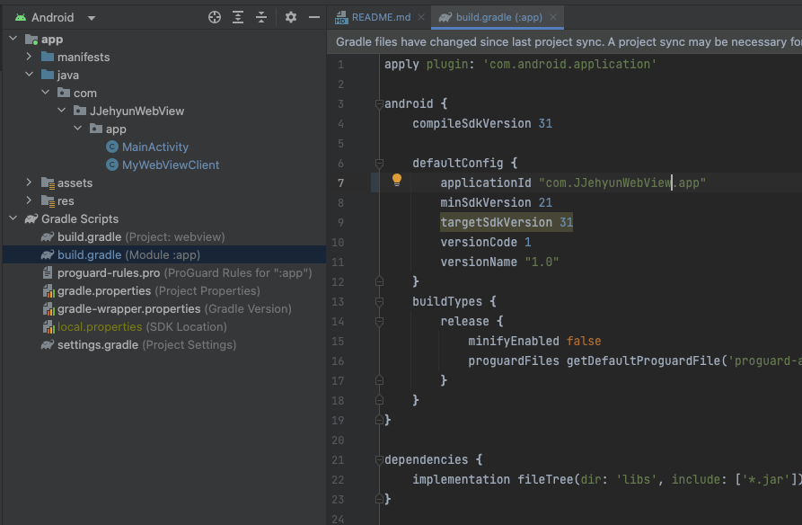
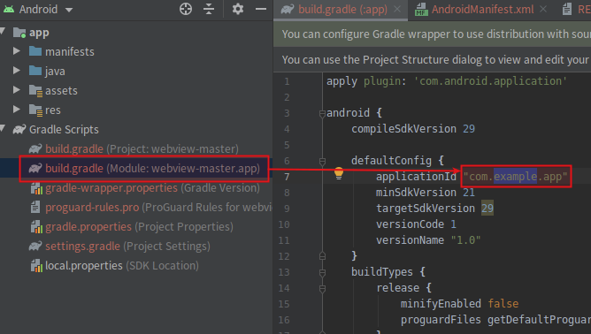
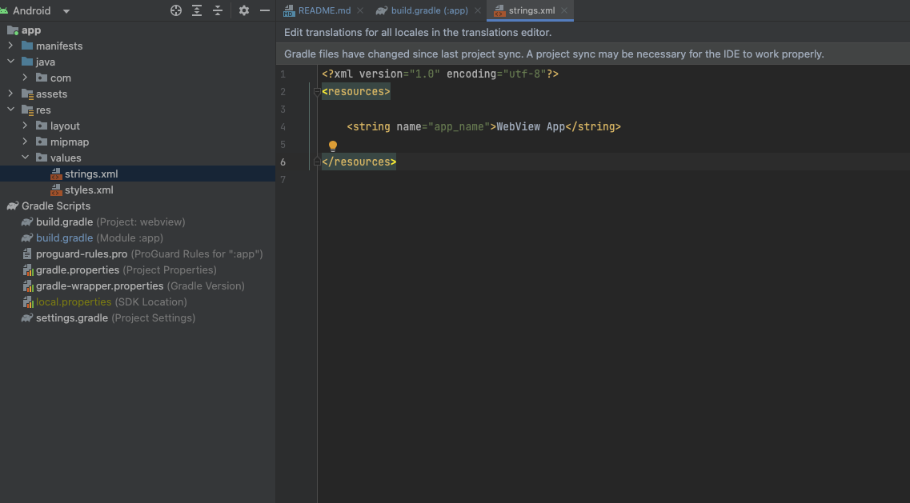
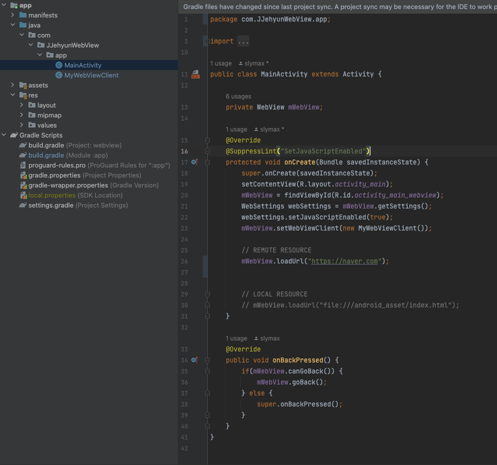

This is a template project for Android Studio that allows you to create an android webview application in minutes. You can use it to create a simple app for your website or as a starting point for your HTML5 based android app.

### Getting started

[Download](https://github.com/slymax/webview/archive/master.zip) or clone this repository and import it into Android Studio.

### Using a remote source

If you want to create an app that shows the content of a remote website

1. uncomment line **24** in `MainActivity.java` and replace `https://example.com` with your url

   ```java
   mWebView.loadUrl("https://example.com");
   ```

2. open the `MyWebViewClient.java` file and replace `example.com` on line **15** with your hostname

   ```java
   hostname = "example.com";
   ```

### Using a local source

If you want to create a local HTML5 android app

1. uncomment line **27** in `MainActivity.java`

   ```java
   mWebView.loadUrl("file:///android_asset/index.html");
   ```

2. put all your files (including your `index.html`) in the `assets` directory

<br />
<br />

---

<br />
<br />

# 1. 패키지 이름 변경 (com.example.app -> com.???.app 변경)

- 
- 
- 
- 
- 

<br />
<br />

```
위 5단계를 거처 package 이름 변경

- 1. build.gradle(Module) : 패키지 이름 변경
- 2. java > com > ??? > app : 패키지 이름 변경
```

<br />

- 

<br />
<br />

```
java > res > values > strings.xml

- <string name="app_name">TEST App</string>
위 부분 TEST App에 원하는 앱 이름 작성
```

<br />
<br />

---

<br />
<br />

# 2. 웹뷰에 띄울 url 삽입 (mWebView.loadUrl)

- 

<br />

```
java > com > ??? > app > MainActivity

24줄 mWebView.loadUrl("웹 url 삽입")
```

<br />
<br />

# 3. 웹뷰 상세 추가 옵션

```
com > ??? > app > MainActivity.kt

//로컬 스토리지 (localStorage) 사용여부
webView.getSettings().setDomStorageEnabled(true);

//폼에 입력된 데이터 저장 여부
webView.getSettings().setSaveFormData(true);

//파일 액세스 허용 여부
webView.getSettings().setAllowFileAccess(true);

//디버그 모드 사용 여부
// -- true 인 경우 크롬에서 "chrome://inspect" 를 통해 웹뷰 확인 가능
webView.setWebContentsDebuggingEnabled(false);

//캐시 사용 여부
webView.getSettings().setAppCacheEnabled(false);

//캐시 설정
webView.getSettings().setCacheMode(WebSettings.LOAD_NO_CACHE);

// -- LOAD_CACHE_ELSE_NETWORK : 캐시 기간만료 시 네트워크 접속
// -- LOAD_CACHE_ONLY : 캐시만 불러옴 (네트워크 사용 X)
// -- LOAD_DEFAULT : 기본 모드, 캐시 사용, 기간 만료 시 네트워크 사용
// -- LOAD_NO_CACHE : 캐시모드 사용안함
// -- LOAD_NORMAL : 기본모드 캐시 사용 @Deprecated

//WebView 화면크기에 맞추도록 설정 - setUseWideViewPort 와 같이 써야함
webView.getSettings().setLoadWithOverviewMode(true);

//wide viewport 설정 - setLoadWithOverviewMode 와 같이 써야함
webView.getSettings().setUseWideViewPort(true);

//줌 설정 여부
webView.getSettings().setSupportZoom(false);

//줌 확대/축소 버튼 여부
webView.getSettings().setBuiltInZoomControls(true);

//자바스크립트 사용 여부
webView.getSettings().setJavaScriptEnabled(true);

//자바스크립트가 window.open()을 사용할 수 있도록 설정
webView.getSettings().setJavaScriptCanOpenWindowsAutomatically(true);

//멀티윈도우 사용 여부
webView.getSettings().setSupportMultipleWindows(true);


//폼에 입력된 데이터 저장 여부
webView.getSettings().setSaveFormData(true);

//파일 액세스 허용 여부
webView.getSettings().setAllowFileAccess(true);

//디버그 모드 사용 여부
// -- true 인 경우 크롬에서 "chrome://inspect" 를 통해 웹뷰 확인 가능
webView.setWebContentsDebuggingEnabled(false);

//사용자 문자열 설정
webView.getSettings().setUserAgentString("app");

//인코딩 설정
webView.getSettings().setDefaultTextEncodingName("UTF-8");

//네트워크를 통해 이미지리소스 받을지 여부
webView.getSettings().setBlockNetworkImage(false);

//database storage API 사용 여부
webView.getSettings().setDatabaseEnabled(false);

//웹뷰를 통해 Content URL 에 접근 사용 여부
webView.getSettings().setAllowContentAccess(true);
```
